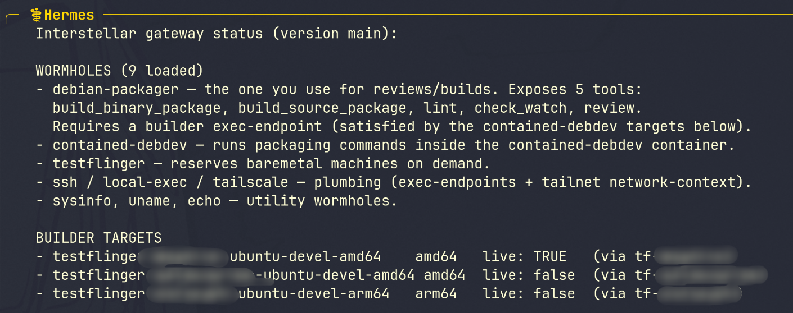
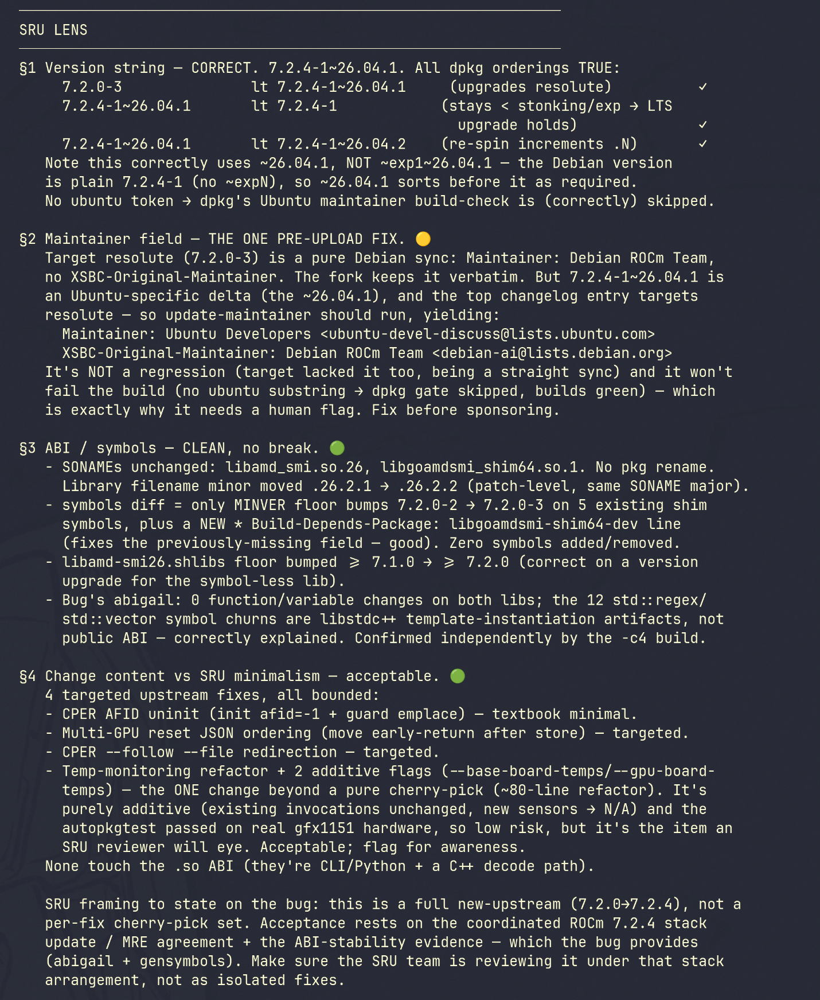
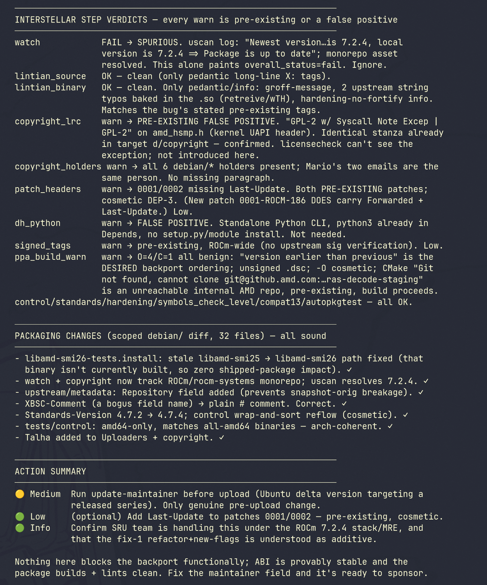

Hi all,

I've been building a small side project to make my own **Debian packaging review workflow** less tedious, and I'd love feedback from people who do this for real — both on the idea and on whether it's actually useful or not.

### The short version

**[interstellar](https://github.com/talhaHavadar/interstellar)** is an MCP server that an AI agent (Hermes Agent, in my case) connects to. Instead of handing the agent raw shell access, its capabilities come from **wormholes** — small, purpose-built plugins that each expose a few _typed_ operations rather than a generic "run this command" tool. The gateway in the middle enforces a capability-based policy and writes an audit log of everything the agent does.

For packaging work I wrote a **`debian-packager`** wormhole (it lives in the companion [wormholes](https://github.com/talhaHavadar/wormholes) repo, alongside a `testflinger` one). So the agent can do things like executing `review` (which has [steps](https://github.com/talhaHavadar/wormholes/tree/main/debian-packager/scripts/review/steps) defined), building source package, building binary packages, linting etc. In a deterministic way.

The design stance is deliberately narrow: wormholes expose specific typed operations, not a shell. Anything that would accept a caller-supplied command is denied by default until I explicitly opt in. The point is to get the _convenience_ of an agent driving the boring parts of a package review without giving it the keys to the machine.

### About the review steps (this is where I most want eyes)

The debian-packager wormhole doesn't just shell out to lintian — it walks the agent through a set of explicit review steps, one file each:

https://github.com/talhaHavadar/wormholes/tree/main/debian-packager/scripts/review/steps

Two honest tensions I want to be upfront about:

- Some steps overlap with what lintian already checks. That's deliberate, not an oversight. Lintian tells you that a tag fired; it doesn't guide agent (for the most part, some info messages are really good though). The steps exist to steer the agent toward a good remediation for specific warnings/errors — the "here's how we'd actually resolve this, and the reasoning" layer that a raw tag doesn't carry.
- Some steps are opinionated. symbols files are the clearest example (like C++ mangling pain hint to the agent). I've baked my own preferences in, and I know reasonable maintainers may disagree here.

So, specifically:

- Which steps are redundant with lintian without adding fix guidance, and should just defer to it?
- Where are my opinionated calls (symbols especially) wrong, or wrong-as-a-default even if fine for my own packages?
- Which warnings/errors are missing a step where a bit of agent guidance would genuinely help?
- Which operations would actually save you time in a real review? What would you like to see added?

### What it looks like in practice

Here's an actual review session with the agent driving the `debian-packager` wormhole:







And here's what the gateway logs on the server side. Two things stand out: the plumbing wormholes (`ssh`, `tailscale`, `testflinger`, `contained-debdev`) all load with `tools=0` — they provide transport and targets, not things the agent can call — while `debian-packager` is the only one exposing agent-callable tools.

On startup it loads the wormholes and serves MCP:

```text
msg="wormhole loaded" name=debian-packager  version=main tools=5
msg="wormhole loaded" name=contained-debdev version=main tools=0
msg="wormhole loaded" name=testflinger      version=main tools=0
msg="wormhole loaded" name=tailscale        version=main tools=0
msg="wormhole loaded" name=ssh              version=0.1.0 tools=0
msg="serving MCP over HTTP" addr=0.0.0.0:8420 version=main
```

Then the agent calls the `review` tool, and the gateway brings the whole chain up on demand — Tailscale, SSH jump, a Testflinger hardware reservation, and finally a clean build container — before running the checklist inside it:

```text
msg="link up"       target=tailnet    wormhole=tailscale       port=tailnet
msg="link up"       target=jump       wormhole=ssh             port=target
msg="link log"      target=hw-amd64   message="testflinger job 82fac5fa… submitted; waiting for the reserved machine (provisioning can take ~45 min)"
# … ~29 min of provisioning elided (including one transient Testflinger OIDC retry) …
msg="link log"      target=hw-amd64   message="reserved machine ready: ubuntu@10.x.x.x (expires 2026-07-08T20:57:56Z)"
msg="link up"       target=hw-amd64   wormhole=testflinger     port=reserved
msg="link log"      target=build-amd64 message="installing contained + podman runtime"
msg="link up"       target=build-amd64 wormhole=contained-debdev port=exec

# chain is up — the review checklist runs inside the container (~3 min):
msg="wormhole log" tool=review message="running review checklist on …/amdsmi@… (several minutes per step)"
msg="wormhole log" tool=review level=warn message="gbp export-orig produced no orig; falling back to uscan"
msg="wormhole log" tool=review message="step patch_headers warned: 2 patch(es) missing DEP-3 fields"
msg="wormhole log" tool=review message="step signed_tags warned: debian/watch does not verify upstream signatures (pgpsigurlmangle/pgpmode)"
msg="wormhole log" tool=review message="step dh_python warned: Python package without dh-python in debian/rules"
msg="wormhole log" tool=review message="step copyright_lrc warned: lrc reported discrepancies (exit 3)"
msg="wormhole log" tool=review message="step copyright_holders warned: compare the two lists above"
msg="wormhole log" tool=review level=warn message="step watch failed: uscan --report failed (exit 1) — watch file broken or upstream unreachable"
msg="wormhole log" tool=review message="step ppa_build_warnings warned: build warnings O=4 D=0 C=1 across archs (amd64, amd64v3)"
msg="wormhole result received" tool=review content_bytes=17856 is_error=false

# same session, next tool call — the chain is still warm, so no re-provisioning:
msg="wormhole log" tool=build_binary_package message="building binary package from …/amdsmi@…"
msg="wormhole log" tool=build_binary_package level=warn message="build warnings: O=2 D=0 C=1 in amdsmi_7.2.4-1~26.04.1_amd64.build"
msg="wormhole result received" tool=build_binary_package content_bytes=5498 is_error=false
```

Note the second call didn't re-reserve or re-provision anything — the Testflinger reservation and the container stay up for the `idle_timeout` window, so a review followed by a build (and however many more) all ride the same warm chain.

When the reservation deadline or idle timeout finally hits, every link tears itself down again (`link down … reason="idle timeout"`), so hardware isn't held longer than needed.

### Trying it yourself

The easiest way to run it is the Docker Compose deployment, which wires up config, secrets, persistence, and optional wormhole installers:

```bash
git clone https://github.com/talhaHavadar/interstellar
cd interstellar/deploy/interstellar-mcp

cp .env.example .env      # secrets (Tailscale auth key, SSH creds, ...)
$EDITOR config.yaml       # define your targets (see below), and possible update docker-compose.yml

docker compose up -d      # gateway comes up on http://127.0.0.1:8420
```

Adding a wormhole is just uncommenting its installer service (and the matching `depends_on` entry) in the compose file — the installer images copy the binary into a shared volume, no local building. The gateway endpoint has **no built-in auth**; it's bound to loopback on purpose. Reach it from elsewhere via an SSH tunnel, a Tailscale ACL, or a reverse proxy that adds auth — not by binding it to `0.0.0.0`.

The compose file itself is mostly wiring — here it is, trimmed of the commented-out extras:

```yaml
services:
  # Wormhole installers: each copies its binary into a shared volume and exits.
  # Enable one by uncommenting it here AND under interstellar.depends_on.
  install-contained-debdev:
    image: ghcr.io/talhahavadar/wormhole-contained-debdev:latest
    volumes: [extra-wormholes:/out]
    restart: "no"
  install-debian-packager:
    image: ghcr.io/talhahavadar/wormhole-debian-packager:latest
    volumes: [extra-wormholes:/out]
    restart: "no"
  install-testflinger:
    image: ghcr.io/talhahavadar/wormhole-testflinger:latest
    volumes: [extra-wormholes:/out]
    restart: "no"

  interstellar:
    image: ghcr.io/talhahavadar/interstellar:latest
    restart: unless-stopped
    depends_on:
      install-contained-debdev: { condition: service_completed_successfully }
      install-debian-packager: { condition: service_completed_successfully }
      install-testflinger: { condition: service_completed_successfully }
    # No built-in auth — bound to loopback on purpose (see note above).
    ports:
      - "127.0.0.1:8420:8420"
    command:
      - --listen=0.0.0.0:8420
      - --config=/etc/interstellar/config.yaml
      - --audit-log=/var/lib/interstellar/audit.jsonl
      - --wormhole-dir=/var/lib/interstellar/wormholes # built-ins
      - --wormhole-dir=/opt/interstellar/wormholes # installed extras
    volumes:
      - ./config.yaml:/etc/interstellar/config.yaml:ro
      - ./id_ed25519:/opt/interstellar/.ssh/id_ed25519:ro # your SSH key, keep private
      - interstellar-data:/var/lib/interstellar # persists the audit log
      - extra-wormholes:/opt/interstellar/wormholes:ro
    env_file: [.env] # secrets live here, not in config
    security_opt:
      - no-new-privileges:true

volumes:
  interstellar-data:
  extra-wormholes:
```

The interesting part, though, is `config.yaml`. A **target** is something the agent can act on; targets can ride on top of other targets via `via:`, and anything marked `visible: false` is hidden from the agent, it's pure plumbing. Here's my actual packaging setup, sanitized and trimmed to one build target (I run three: two amd64, one arm64):

```yaml
targets:
  # What the agent SEES: build/lint/review on ubuntu-devel.
  # Real hardware underneath, but to the agent it's just a target.
  build-amd64:
    wormhole: contained-debdev # runs steps inside a clean container
    port: exec
    config:
      image: ghcr.io/talhahavadar/contained-debdev:ubuntu-devel
      runtime: podman
      ensure_deps: true
      install_runtime: true
    open_timeout: 60m # waits on the hardware reservation below
    idle_timeout: 3h # reserve once, build/lint/review many times
    via:
      host: hw-amd64

  # --- everything below is hidden plumbing (visible: false) ---

  hw-amd64: # reserve a real machine via Testflinger
    wormhole: testflinger
    port: reserved
    visible: false
    config:
      job_file: /path/to/testflinger-amd64.yaml
      ssh_keys: ["gh:YOURHANDLE"]
      reserve_timeout_secs: 21600
    open_timeout: 60m
    idle_timeout: 1h
    via:
      orchestrator: jump

  jump: # SSH jump host into the lab
    wormhole: ssh
    port: target
    visible: false
    config:
      host: JUMP_HOST
      user: YOURUSER
      key_file: /opt/interstellar/.ssh/id_ed25519
      insecure_skip_host_key_check: true # deliberate opt-out for this host
    via:
      net: tailnet

  tailnet: # userspace Tailscale; authkey from env
    wormhole: tailscale
    port: tailnet
    visible: false
    config:
      hostname: interstellar-gw
      authkey_env: TS_AUTHKEY

policy:
  deny_capabilities: [exec.arbitrary] # no generic shell, ever
  wormholes: {}
```

So the agent is only ever offered "build/lint/review on ubuntu-devel (amd64/arm64)". The Testflinger reservation, the SSH jump, and the VPN are all `visible: false` — it rides the chain without being able to see or address the hosts. And `exec.arbitrary` is denied globally, so even a compromised agent can't get a generic shell. Secrets (the Tailscale key, SSH creds) come from `.env`, never from `config.yaml`.

Then point your agent at it — for Claude Code:

```bash
claude mcp add --transport http interstellar http://127.0.0.1:8420
```

For Hermes Agent:

```yaml
# add this in config.yaml
mcp_servers:
  interstellar:
    url: http://127.0.0.1:8420
    timeout: 3600
```

Ask it to call `interstellar__status` first to confirm your wormholes, tools, and targets loaded (it also tells you _why_ a tool is hidden if policy or a missing target excludes it).

Full compose docs: <https://github.com/talhaHavadar/interstellar/tree/main/deploy/interstellar-mcp>

Repos (both Apache-2.0 / MIT):

- Gateway: <https://github.com/talhaHavadar/interstellar>
- Wormholes (incl. `debian-packager`): <https://github.com/talhaHavadar/wormholes>

Thanks for reading — happy to answer anything.
